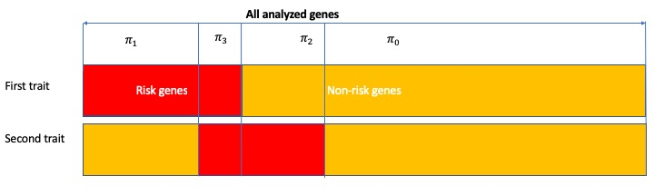
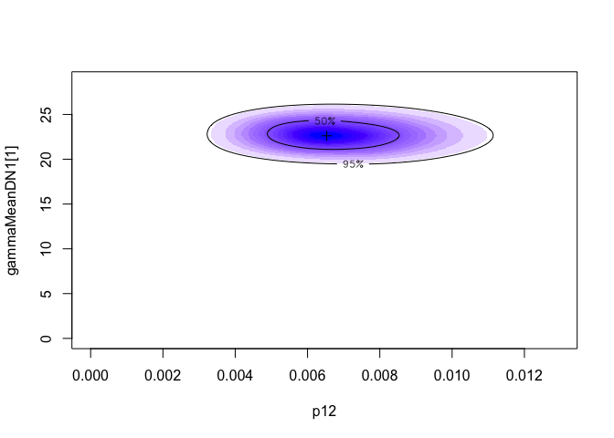

-   [`mTADA`](#textttmtada)
    -   [I. Introduction](#i.-introduction)
        -   [Data for reproducible
            analyses](#data-for-reproducible-analyses)
    -   [II. Requirements](#ii.-requirements)
    -   [III. An example: joint analysis of DD and EE
        DNMs](#iii.-an-example-joint-analysis-of-dd-and-ee-dnms)
        -   [Load the source codes](#load-the-source-codes)
        -   [Read the data and single-trait
            parameters](#read-the-data-and-single-trait-parameters)
        -   [Set parameters for two
            traits](#set-parameters-for-two-traits)
        -   [Run `mTADA`](#run-textttmtada)
        -   [Obtain analysis results](#obtain-analysis-results)
    -   [Citation](#citation)

`mTADA`
=======

This notebook descibes steps used to jointly analyze two traits by
`mTADA`.

I. Introduction
---------------

**`mTADA` jointly analyze de novo mutations (DNMs) of two traits to 1)
estimate the gene-level genetic overlap of the two traits; 2) report
shared and specific risk genes; and 3) identify additional risk genes
for each analyzed trait.**

The method requires genetic parameters from single-trait analyses (the
third and fourth columns in Table 1 below). Users can obtain
single-trait parameters from `extTADA/TADA` methods.

**Table 1. `mTADA` model for one variant category at the**
*i*<sup>*th*</sup> **gene**.

<table>
<colgroup>
<col style="width: 23%" />
<col style="width: 21%" />
<col style="width: 25%" />
<col style="width: 29%" />
</colgroup>
<thead>
<tr class="header">
<th><strong>Hypothesis</strong></th>
<th>Proportion</th>
<th>First trait</th>
<th>Second trait</th>
</tr>
</thead>
<tbody>
<tr class="odd">
<td><span class="math inline"><em>H</em><sub>0</sub></span></td>
<td><span class="math inline"><em>π</em><sub>0</sub></span></td>
<td><span class="math inline"><em>x</em><sub><em>i</em>1</sub></span> ~ <span class="math inline"><em>P</em><em>o</em><em>i</em><em>s</em><em>s</em><em>o</em><em>n</em>(2<em>N</em><sub>1</sub><em>μ</em><sub><em>i</em></sub>)</span></td>
<td><span class="math inline"><em>x</em><sub><em>i</em>2</sub> ∼ <em>P</em><em>o</em><em>i</em><em>s</em><em>s</em><em>o</em><em>n</em>(2<em>N</em><sub>2</sub><em>μ</em><sub><em>i</em></sub>)</span></td>
</tr>
<tr class="even">
<td><span class="math inline"><em>H</em><sub>1</sub></span></td>
<td><span class="math inline"><em>π</em><sub>1</sub></span></td>
<td><span class="math inline"><em>x</em><sub><em>i</em>1</sub> ∼ <em>P</em><em>o</em><em>i</em><em>s</em><em>s</em><em>o</em><em>n</em>(2<em>N</em><sub>1</sub><em>γ</em><sub>1</sub><em>μ</em><sub><em>i</em></sub>)</span>; <span class="math inline"><em>γ</em><sub>1</sub></span> ~ <span class="math inline"><em>G</em><em>a</em><em>m</em><em>m</em><em>a</em>(<em>γ̄</em><sub>1</sub><em>β</em><sub>1</sub>, <em>β</em><sub>1</sub>)</span></td>
<td><span class="math inline"><em>x</em><sub><em>i</em>2</sub> ∼ <em>P</em><em>o</em><em>i</em><em>s</em><em>s</em><em>o</em><em>n</em>(2<em>N</em><sub>2</sub><em>μ</em><sub><em>i</em></sub>)</span></td>
</tr>
<tr class="odd">
<td><span class="math inline"><em>H</em><sub>2</sub></span></td>
<td><span class="math inline"><em>π</em><sub>2</sub></span></td>
<td><span class="math inline"><em>x</em><sub><em>i</em>1</sub> ∼ <em>P</em><em>o</em><em>i</em><em>s</em><em>s</em><em>o</em><em>n</em>(2<em>N</em><sub>1</sub><em>μ</em><sub><em>i</em></sub>)</span></td>
<td><span class="math inline"><em>x</em><sub><em>i</em>2</sub> ∼ <em>P</em><em>o</em><em>i</em><em>s</em><em>s</em><em>o</em><em>n</em>(2<em>N</em><sub>2</sub><em>γ</em><sub>2</sub><em>μ</em><sub><em>i</em></sub>)</span>; <span class="math inline"><em>γ</em><sub>2</sub></span> ~ <span class="math inline"><em>G</em><em>a</em><em>m</em><em>m</em><em>a</em>(<em>γ̄</em><sub>2</sub><em>β</em><sub>2</sub>, <em>β</em><sub>2</sub>)</span></td>
</tr>
<tr class="even">
<td><span class="math inline"><em>H</em><sub>3</sub></span></td>
<td><span class="math inline"><em>π</em><sub>3</sub></span></td>
<td><span class="math inline"><em>x</em><sub><em>i</em>1</sub> ∼ <em>P</em><em>o</em><em>i</em><em>s</em><em>s</em><em>o</em><em>n</em>(2<em>N</em><sub>1</sub><em>γ</em><sub>1</sub><em>μ</em><sub><em>i</em></sub>)</span>; <span class="math inline"><em>γ</em><sub>1</sub></span> ~ <span class="math inline"><em>G</em><em>a</em><em>m</em><em>m</em><em>a</em>(<em>γ̄</em><sub>1</sub><em>β</em><sub>1</sub>, <em>β</em><sub>1</sub>)</span></td>
<td><span class="math inline"><em>x</em><sub><em>i</em>2</sub> ∼ <em>P</em><em>o</em><em>i</em><em>s</em><em>s</em><em>o</em><em>n</em>(2<em>N</em><sub>2</sub><em>γ</em><sub>2</sub><em>μ</em><sub><em>i</em></sub>)</span>; <span class="math inline"><em>γ</em><sub>2</sub></span> ~ <span class="math inline"><em>G</em><em>a</em><em>m</em><em>m</em><em>a</em>(<em>γ̄</em><sub>2</sub><em>β</em><sub>2</sub>, <em>β</em><sub>2</sub>)</span></td>
</tr>
</tbody>
</table>

**Figure 1. `mTADA` framework.**



#### Data for reproducible analyses

Data used in the main manuscript are inside the folder [data](data):

1.  [FullDataSet\_DenovoMutations\_for\_mTADA.txt](data/FullDataSet_DenovoMutations_for_mTADA.txt):
    all gene-level de novo mutations. These DNMs are used in the main
    manuscript.

2.  [SingleTrait\_Parameters.txt](data/SingleTrait_Parameters.txt): all
    single-trait parameters. We used `extTADA` to estimate these
    parameters from the DNMs above.

    *Note*: Users can re-run all these single-trait analyses by
    following an example here:
    <a href="https://github.com/hoangtn/extTADA" class="uri">https://github.com/hoangtn/extTADA</a>.

II. Requirements
----------------

**`mTADA` is written in `R`**. Other `R` packages are required to run
`mTADA`:

-   `rstan`:
    <a href="https://mc-stan.org/rstan/" class="uri">https://mc-stan.org/rstan/</a>.

-   `locfit`:
    <a href="https://cran.r-project.org/web/packages/locfit/index.html" class="uri">https://cran.r-project.org/web/packages/locfit/index.html</a>.

Software versions were used in our analyses: `R` version 3.5.2, `locfit`
version 1.5-9.1, and `rstan` version 2.18.2.

III. An example: joint analysis of DD and EE DNMs
-------------------------------------------------

Only one function `mTADA` (in the **Run `mTADA`** section) is used to
obtain results. Therefore, users can go directly to the **Run `mTADA`**
section to run `mTADA`. However, some additional steps are described
here.

### Load the source codes

``` r
dataDir <- "./data/"
source("script/mTADA.R")
```

    ## locfit 1.5-9.1    2013-03-22

### Read the data and single-trait parameters

``` r
## De novo data
data <- read.table(paste0(dataDir, "FullDataSet_DenovoMutations_for_mTADA.txt"), header = TRUE, as.is = TRUE) 
## Single-trait parameters
sPar <- read.table(paste0(dataDir, "SingleTrait_Parameters.txt"), as.is = TRUE, header = TRUE)

trait1 = "DD"
trait2 = "EE"
##Take a quick look at the single-trait parameters of DD and EE
sPar[grep(trait1, sPar[, 1]), ] ##Trait 1
```

    ##                 Parameter EstimatedValue
    ## 8                DD_pi[1]     0.02936283
    ## 9  DD_hyperGammaMeanDN[1]    22.31762802
    ## 10 DD_hyperGammaMeanDN[2]    86.03966530
    ## 11      DD_hyperBetaDN[1]     0.82594514
    ## 12      DD_hyperBetaDN[2]     0.80689775

``` r
sPar[grep(trait2, sPar[, 1]), ] ##Trait 2
```

    ##                 Parameter EstimatedValue
    ## 18               EE_pi[1]     0.01548789
    ## 19 EE_hyperGammaMeanDN[1]    51.08181282
    ## 20 EE_hyperGammaMeanDN[2]    65.15189031
    ## 21      EE_hyperBetaDN[1]     0.80906448
    ## 22      EE_hyperBetaDN[2]     0.80774192

### Set parameters for two traits

As described above, `mTADA` needs single-trait parameters:

-   the number of trios: *ntrio*;

-   the mean and disperson parameters of relative risks:
    *γ̄*<sub>*j*</sub> and *β*<sub>*j*</sub> (j=1, 2);

-   the proportion of risk genes: *π*<sub>1</sub><sup>*S*</sup> and
    *π*<sub>2</sub><sup>*S*</sup>.

**All these parameters are shown above.**

``` r
### Trait-1 INFORMATION
ntrio1 = 4293 #family numbers                                                                   
p1 = 0.02936283 #The proportion of risk genes, this is p1S                                
meanGamma1 = c(22.31762802,  86.03966530) #Mean Gamma of two categories                     
beta1 = c(0.82594514, 0.80689775) #Beta values inside the distribution RR ~ Gamma(meanRR*beta, beta)     
dataT1 <- data[, paste0(c("dn_damaging_", "dn_lof_"), trait1)] #De novo data              
muDataT1 <- data[, c("mut_damaging", "mut_lof")] #Mutation data of the first trait              
##########################################
### Trait-2 INFORMATION
ntrio2 = 356
p2 = 0.01548789 #This is p2S
meanGamma2 = c(51.08181282, 65.15189031)
beta2 = c(0.80906448, 0.80774192)
dataT2 <- data[, paste0(c("dn_damaging_", "dn_lof_"), trait2)]
muDataT2 <- muDataT1
```

### Run `mTADA`

In this example, we only use a small number of iterations and two MCMC
chains. However, users can change these parameters to obtain more
reliable results.

``` r
nIteration = 2000 #This should be higher to obtain better results.
nChain = 2 #The number of MCMC chains

##########MAIN ANALYSIS
mTADAresults <- mTADA(geneName = data[, 1],
    #######Trait-1 information
                  ntrio1 = ntrio1, # Trio number of Trait 1
                  p1 = p1, #Risk-gene proportion of Trait 1
                  dataDN1 = data.frame(dataT1), #De novo data of Trait 1
                  mutRate1 = data.frame(muDataT1), # Mutation rates of Trait 1
                  hyperGammaMeanDN1 = c(meanGamma1), # Mean relative risks of Trait 1
                  hyperBetaDN01 = beta1, #NULL, #array(c(1, 1)),                                        
    #######Trait-2 information
                  ntrio2 = ntrio2, # Trio number of Trait 2
                  p2 = p2, #Risk-gene proportion of Trait 2
                  dataDN2 = data.frame(dataT2), # De novo data of Trait 2
                  mutRate2 = data.frame(muDataT2), # Mutation rates of Trait 2
                  hyperGammaMeanDN2 = c(meanGamma2), # Mean relative risks of Trait 2
                  hyperBetaDN02 = beta2, #NULL, #array(c(1, 1)),                                    
    ####Other parameters               
                  nIteration = nIteration,
                  useMCMC = TRUE, #If FALSE, it will use the 'Variational Bayes' approach. 
                  nChain = nChain
                      )
```

    ## No information for core numbers (nCore); therefore, nCore = nChain: 2 core(s) is/are used

    ## Loading required package: ggplot2

    ## Loading required package: StanHeaders

    ## rstan (Version 2.18.2, GitRev: 2e1f913d3ca3)

    ## For execution on a local, multicore CPU with excess RAM we recommend calling
    ## options(mc.cores = parallel::detectCores()).
    ## To avoid recompilation of unchanged Stan programs, we recommend calling
    ## rstan_options(auto_write = TRUE)

    ## ===================
    ## Building the model
    ## =================

    ## 
    ## =======Use MCMC===========

    ## recompiling to avoid crashing R session

    ## ====
    ## Only pi, alpha and hyper parameters are estimated in this step
    ## The method does not calculate HPDs for hyper betas, just their medians
    ## ===

### Obtain analysis results

`mTADA`’s output includes:

1.  `data`: main gene-level results (posterior probabilities for the
    four models as described in the main manuscript: PP0, PP1, PP2 and
    PP3).

2.  `probModel`: a vector of *π*<sub>*j*</sub>, (*j* = 0..3) in Table 1.

3.  `pars`: the estimated value and credible interval of *π*<sub>3</sub>
    (described as p12 in the our code).

4.  `mcmcData`: MCMC sampling results for *π*<sub>3</sub>.

The most important information is from `data`. **Users can use this
information to obtain top prioritized genes for downstream analyses
(e.g., top shared/specific genes, top genes for each trait)**. However,
we will also take a quick look at all these information.

#### Results for downstream analyses (gene-level posterior probabilities (PPs) of four models)

We will demonstrate how to choose top proritized genes from `mTADA`’s
results using a PP threshold of 0.8. These genes can be shared genes,
specific genes; or genes for single traits.

``` r
fData <- mTADAresults$data ## Full analysis results of the two-trait analysis.
head(fData)
```

    ##   geneName dn_damaging_DD dn_lof_DD dn_damaging_EE dn_lof_EE        NO
    ## 1     A1BG              0         0              0         0 0.9785638
    ## 2 A1BG-AS1              0         0              0         0 0.9648110
    ## 3     A1CF              0         0              0         0 0.9894511
    ## 4      A2M              0         0              1         0 0.7728022
    ## 5  A2M-AS1              0         0              0         0 0.9638173
    ## 6    A2ML1              0         0              0         0 0.9920417
    ##           BOTH        FIRST      SECOND
    ## 1 0.0028849335 0.0102232990 0.008327935
    ## 2 0.0060903853 0.0204204671 0.008678102
    ## 3 0.0006499363 0.0026904350 0.007208518
    ## 4 0.0025131770 0.0002609915 0.224423609
    ## 5 0.0063273659 0.0211660881 0.008689214
    ## 6 0.0002100015 0.0009201318 0.006828191

##### Genes with PP3 &gt; 0.8 (Posterior probabilities of Model 3)

Shared risk genes between DD and EE.

``` r
fData[fData$BOTH > 0.8, ]
```

    ##       geneName dn_damaging_DD dn_lof_DD dn_damaging_EE dn_lof_EE
    ## 2348   CACNA1A              5         0              2         0
    ## 3201      CHD2              0         6              0         1
    ## 6254    GABBR2              2         0              2         0
    ## 6265    GABRB3              2         0              2         0
    ## 6610     GNAO1              4         1              2         0
    ## 7165     HECW2              5         1              1         0
    ## 7426    HNRNPU              0         7              0         1
    ## 8283     KCNQ2              9         0              2         0
    ## 8284     KCNQ3              3         0              1         0
    ## 10146      MLL              1        26              1         0
    ## 12480     PHIP              1         2              0         1
    ## 14673    SCN2A              9         4              2         0
    ## 14681    SCN8A              6         0              2         0
    ## 16228   STXBP1              6         5              4         1
    ##                 NO      BOTH        FIRST       SECOND
    ## 2348  3.061557e-04 0.9934586 3.857158e-03 2.378089e-03
    ## 3201  4.538516e-10 0.9373802 6.261984e-02 2.048901e-10
    ## 6254  2.475216e-03 0.9531470 1.665815e-03 4.271197e-02
    ## 6265  9.065089e-04 0.9802813 1.552743e-03 1.725944e-02
    ## 6610  1.573114e-08 0.9984154 1.584264e-03 2.989837e-07
    ## 7165  1.903578e-06 0.8924003 1.075973e-01 4.761376e-07
    ## 7426  8.628766e-13 0.9367325 6.326751e-02 3.852893e-13
    ## 8283  3.189291e-13 0.9982274 1.772551e-03 5.416619e-12
    ## 8284  4.242399e-03 0.9136293 8.067943e-02 1.448846e-03
    ## 10146 1.458250e-48 0.8681168 1.318832e-01 2.894838e-49
    ## 12480 1.444210e-02 0.8916606 8.956108e-02 4.336247e-03
    ## 14673 3.061183e-18 0.9964569 3.543136e-03 2.596351e-17
    ## 14681 4.151136e-06 0.9959737 3.990920e-03 3.124247e-05
    ## 16228 7.521732e-24 1.0000000 9.762103e-09 2.323688e-17

##### Genes with PP1 &gt; 0.8 (Posterior probabilities of Model 1)

Specific risk genes for DD.

``` r
fData[fData$FIRST > 0.8, ]
```

    ##       geneName dn_damaging_DD dn_lof_DD dn_damaging_EE dn_lof_EE
    ## 681    ANKRD11              0        32              0         0
    ## 1001    ARID1B              0        30              0         0
    ## 1002     ARID2              0         3              0         0
    ## 1153     ASXL1              0         4              0         0
    ## 1317     AUTS2              0         4              0         0
    ## 1450    BCL11A              2         3              0         0
    ## 1630     BRPF1              0         4              0         0
    ## 2355   CACNA1E              2         2              0         0
    ## 2434    CAMTA1              1         2              0         0
    ## 3202      CHD3              3         1              0         0
    ## 3203      CHD4              5         1              0         0
    ## 3206      CHD7              2         2              0         0
    ## 3457      CLTC              2         3              0         0
    ## 3516     CNOT3              2         2              0         0
    ## 3599  COL4A3BP              4         0              0         0
    ## 3773    CREBBP              7         3              0         0
    ## 3876   CSNK2A1              4         0              0         0
    ## 3924      CTCF              5         0              0         0
    ## 3942    CTNNB1              0        11              0         0
    ## 4632    DNMT3A              4         1              0         0
    ## 4832    DYRK1A              4        14              0         0
    ## 4861      EBF3              2         3              0         0
    ## 4948    EFTUD2              3         2              0         0
    ## 4974     EHMT1              2         7              0         0
    ## 5157     EP300              3        12              0         0
    ## 6120     FOXP1              4         8              0         0
    ## 6121     FOXP2              1         2              0         0
    ## 7330    HIVEP2              2         2              0         0
    ## 7333       HK1              3         1              0         0
    ## 8168    KANSL1              0         8              0         0
    ## 8177     KAT6A              0         8              0         0
    ## 8178     KAT6B              0         8              0         0
    ## 8211     KCNB1              2         1              0         0
    ## 8228     KCNH1              4         0              0         0
    ## 8336     KDM5B              0         3              0         0
    ## 9618     LZTR1              2         1              0         0
    ## 9727    MAP4K4              3         2              0         0
    ## 9906    MED13L              5        13              0         0
    ## 9935     MEF2C              4         4              0         0
    ## 10670    MYT1L              2         2              0         0
    ## 10978     NFIX              1         4              0         0
    ## 11282     NSD1              1         7              0         0
    ## 12004    PACS1              8         0              0         0
    ## 12831     POGZ              0         6              0         0
    ## 12994    PPM1D              0         5              0         0
    ## 13062  PPP2R5D             12         0              0         0
    ## 13250  PRPF40A              1         2              0         0
    ## 13538    PUF60              0         3              0         0
    ## 13540     PUM2              1         2              0         0
    ## 13541     PURA              3         7              0         0
    ## 14894    SETD2              1         2              0         0
    ## 14897    SETD5              2        14              0         0
    ## 15074    SIN3A              1         3              0         0
    ## 15133  SLC12A2              2         1              0         0
    ## 15440   SLC6A1              6         2              0         0
    ## 15546  SMARCA2              9         0              0         0
    ## 15752      SON              0         3              0         0
    ## 15985    SRCAP              1         4              0         0
    ## 16337  SYNGAP1              0        13              0         0
    ## 16578    TCF12              1         2              0         0
    ## 16581    TCF20              0         5              0         0
    ## 16587     TCF4              4         9              0         0
    ## 17284    TNPO3              1         2              0         0
    ## 17548   TRIP12              2         3              0         0
    ## 18337    WDR26              1         2              0         0
    ## 18420    WHSC1              0         3              0         0
    ##                 NO       BOTH     FIRST       SECOND
    ## 681   2.297741e-60 0.13872908 0.8612709 1.116175e-62
    ## 1001  1.704450e-56 0.14641883 0.8535812 8.817382e-59
    ## 1002  2.193691e-03 0.17485453 0.8229377 1.405687e-05
    ## 1153  1.845391e-05 0.17279546 0.8271860 1.162575e-07
    ## 1317  1.133833e-05 0.18488529 0.8151033 7.756077e-08
    ## 1450  7.457047e-07 0.19110833 0.8088909 5.313246e-09
    ## 1630  7.118090e-05 0.13281732 0.8671112 3.288114e-07
    ## 2355  4.915877e-02 0.08914968 0.8615381 1.534086e-04
    ## 2434  1.012129e-02 0.17035744 0.8194578 6.345614e-05
    ## 3202  5.977087e-02 0.11099360 0.8289942 2.413456e-04
    ## 3203  5.540230e-04 0.08766979 0.9117746 1.606548e-06
    ## 3206  4.704508e-02 0.10112344 0.8516630 1.684619e-04
    ## 3457  6.341962e-05 0.11784625 0.8820901 2.555229e-07
    ## 3516  1.534432e-04 0.17760910 0.8222365 9.995846e-07
    ## 3599  1.573369e-03 0.18553072 0.8128851 1.082981e-05
    ## 3773  1.302498e-10 0.09353761 0.9064624 4.053376e-13
    ## 3876  8.953515e-04 0.19751095 0.8015870 6.653305e-06
    ## 3924  3.492562e-05 0.19339259 0.8065722 2.525481e-07
    ## 3942  1.541043e-19 0.18239881 0.8176012 1.036809e-21
    ## 4632  3.852259e-05 0.17170928 0.8282520 2.408519e-07
    ## 4832  5.189173e-31 0.18805603 0.8119440 3.624622e-33
    ## 4861  8.613568e-07 0.18991149 0.8100876 6.089838e-09
    ## 4948  2.505835e-05 0.14945560 0.8505192 1.327957e-07
    ## 4974  2.140993e-13 0.14691102 0.8530890 1.111933e-15
    ## 5157  4.079682e-23 0.11138649 0.8886135 1.542231e-25
    ## 6120  1.001012e-18 0.17612505 0.8238750 6.453606e-21
    ## 6121  5.432492e-03 0.17654382 0.8179883 3.535965e-05
    ## 7330  1.640057e-03 0.14126349 0.8570883 8.152047e-06
    ## 7333  2.808436e-03 0.14421099 0.8529663 1.431972e-05
    ## 8168  1.948521e-13 0.18350266 0.8164973 1.320675e-15
    ## 8177  2.074813e-12 0.15071096 0.8492890 1.110380e-14
    ## 8178  1.001571e-12 0.15819723 0.8418028 5.676406e-15
    ## 8211  8.664847e-03 0.17746796 0.8138102 5.698508e-05
    ## 8228  2.404097e-03 0.17053318 0.8270478 1.494974e-05
    ## 8336  3.015563e-02 0.12310789 0.8466042 1.322444e-04
    ## 9618  2.094615e-02 0.16293339 0.8159943 1.261336e-04
    ## 9727  2.185163e-04 0.12698830 0.8727922 9.588267e-07
    ## 9906  1.527178e-28 0.12419530 0.8758047 6.531170e-31
    ## 9935  2.503506e-11 0.18133828 0.8186617 1.672388e-13
    ## 10670 5.479651e-04 0.15615945 0.8432895 3.060186e-06
    ## 10978 2.422783e-07 0.18309500 0.8169048 1.637657e-09
    ## 11282 2.440202e-11 0.13734200 0.8626580 1.171639e-13
    ## 12004 5.419168e-09 0.17478338 0.8252166 3.461530e-11
    ## 12831 1.677565e-09 0.19281239 0.8071876 1.208490e-11
    ## 12994 5.314446e-08 0.19463984 0.8053601 3.873495e-10
    ## 13062 5.258058e-15 0.17487375 0.8251263 3.360725e-17
    ## 13250 8.685049e-03 0.16444484 0.8268180 5.209380e-05
    ## 13538 2.908053e-04 0.19727664 0.8024304 2.156125e-06
    ## 13540 8.187980e-03 0.16161836 0.8301456 4.807471e-05
    ## 13541 2.499371e-16 0.19844222 0.8015578 1.866093e-18
    ## 14894 4.852918e-02 0.15035019 0.8008459 2.747650e-04
    ## 14897 1.795241e-27 0.16947547 0.8305245 1.104792e-29
    ## 15074 2.376476e-04 0.14856417 0.8511969 1.250895e-06
    ## 15133 5.046412e-02 0.14547211 0.8037883 2.754382e-04
    ## 15440 2.196975e-10 0.18675291 0.8132471 1.521505e-12
    ## 15546 1.418853e-08 0.11378454 0.8862154 5.493950e-11
    ## 15752 3.836161e-03 0.16715345 0.8289871 2.332748e-05
    ## 15985 3.773627e-05 0.12710945 0.8728526 1.657293e-07
    ## 16337 1.016582e-22 0.15249346 0.8475065 5.516375e-25
    ## 16578 3.104402e-03 0.17794702 0.8189282 2.034353e-05
    ## 16581 1.278363e-07 0.19166762 0.8083323 9.141475e-10
    ## 16587 1.136552e-20 0.16930787 0.8306921 6.986022e-23
    ## 17284 6.738068e-03 0.17422658 0.8189921 4.322883e-05
    ## 17548 4.285968e-05 0.13907921 0.8608777 2.088205e-07
    ## 18337 1.979577e-03 0.18717380 0.8108328 1.378128e-05
    ## 18420 3.986182e-03 0.15093289 0.8450595 2.147124e-05

##### Genes with PP2 &gt; 0.8 (Posterior probabilities of Model 2)

Specific risk genes for EE.

``` r
fData[fData$SECOND > 0.8, ]
```

    ##       geneName dn_damaging_DD dn_lof_DD dn_damaging_EE dn_lof_EE
    ## 14671    SCN1A              2         0              4         4
    ##                 NO      BOTH        FIRST    SECOND
    ## 14671 2.043814e-12 0.1216637 8.537782e-15 0.8783363

#### Use mTADA’s results for single-trait analyses.

We can obtain single-trait results by summing PP1 and PP3 (Trait 1) or
PP2 and PP3 (Trait 2).

##### Trait 1

Top prioritized genes of DD.

``` r
fData[, 'pTrait1'] <- fData[, 'BOTH'] + fData[, 'FIRST']
fData1 <- fData[fData$pTrait1 > 0.8, ]
head(fData1[, c(1:5, 10)])
```

    ##      geneName dn_damaging_DD dn_lof_DD dn_damaging_EE dn_lof_EE   pTrait1
    ## 347      ADNP              1        19              0         0 1.0000000
    ## 447     AHDC1              0         8              0         0 1.0000000
    ## 681   ANKRD11              0        32              0         0 1.0000000
    ## 1000   ARID1A              1         2              0         0 0.9148468
    ## 1001   ARID1B              0        30              0         0 1.0000000
    ## 1002    ARID2              0         3              0         0 0.9977923

##### Trait 2

Top prioritized genes of EE.

``` r
fData[, 'pTrait2'] <- fData[, 'BOTH'] + fData[, 'SECOND']
fData2 <- fData[fData$pTrait2 > 0.8, ]
head(fData2[, c(1:5, 11)])
```

    ##      geneName dn_damaging_DD dn_lof_DD dn_damaging_EE dn_lof_EE   pTrait2
    ## 2348  CACNA1A              5         0              2         0 0.9958367
    ## 3201     CHD2              0         6              0         1 0.9373802
    ## 6254   GABBR2              2         0              2         0 0.9958590
    ## 6265   GABRB3              2         0              2         0 0.9975407
    ## 6610    GNAO1              4         1              2         0 0.9984157
    ## 7165    HECW2              5         1              1         0 0.8924008

#### Other information

Some additional information can be obtained from mTADA’s results.

``` r
pCI <- mTADAresults$pars ## Genetic parameters
piValue <- mTADAresults$probModel ## Posterior probabilities of genes for four models
mcmcResult <- mTADAresults$mcmcData ##MCMC results
```

##### The proportions of risk genes

*piValue* is a vector of *π* values. In the result below, pNO, pFIRST,
pSECOND, and pBOTH are *π*<sub>0</sub>, *π*<sub>1</sub>, *π*<sub>2</sub>
and *π*<sub>3</sub> respectively in **Table 1**.

``` r
piValue
```

    ##         pNO      pFIRST     pSECOND       pBOTH 
    ## 0.961928644 0.022583466 0.008708526 0.006779364

##### Estimated information of *π*<sub>3</sub>.

Credible-interval information is from *p**C**I*.

``` r
pCI ## Mode: estimated values; CI: credible interval with low (l) and upper (u) values
```

    ##                         Mode          lCI         uCI
    ## p12              0.006779364  0.003786445  0.01006793
    ## gammaMeanDN1[1] 22.848744547 20.082794919 25.60378408

To check the convergent information of *π*<sub>3</sub>, we can visualize
MCMC results.

``` r
## p12 is pi3 in the model
plotParHeatmap1(mcmcResult = mcmcResult, pars = c('p12', 'gammaMeanDN1[1]'))
```



Citation
--------

**`mTADA`: a framework for identifying risk genes from de novo mutations
in multiple traits.** Hoang T. Nguyen, Amanda Dobbyn, Ruth C. Brown,
Brien P. Riley, Joseph Buxbaum, Dalila Pinto, Shaun M Purcell, Patrick F
Sullivan, Xin He, Eli A. Stahl.
