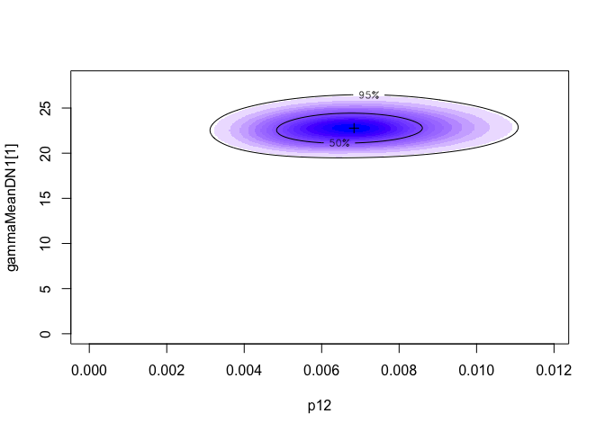

-   [I. Introduction](#i.-introduction)
    -   [Data for reproducible
        analyses](#data-for-reproducible-analyses)
-   [II. Requirements](#ii.-requirements)
-   [III. An example: joint analysis of DD and EE
    DNMs.](#iii.-an-example-joint-analysis-of-dd-and-ee-dnms.)
    -   [Load the source codes](#load-the-source-codes)
    -   [Read the data and single-trait
        parameters](#read-the-data-and-single-trait-parameters)
    -   [Set parameters for two
        traits.](#set-parameters-for-two-traits.)
    -   [Run `mTADA`](#run-textttmtada)
    -   [Get results](#get-results)
-   [Citation](#citation)

This notebook descibes steps used to jointly analyze two traits by
`mTADA`.

I. Introduction
---------------

**`mTADA` jointly analyze de novo mutations (DNMs) of two traits to 1)
estimate the gene-level genetic overlap of the two traits; 2) report
shared and specific risk genes; and 3) identify additional risk genes
for each analyzed trait.**

The method requires genetic parameters from single-trait analyses (the
third and fourth columns in Table 1 below). Users can obtain
single-trait parameters from `extTADA/TADA` methods.

**Table 1. `mTADA` model for one variant category at the**
*i*<sup>*t**h*</sup> **gene**.

<table>
<colgroup>
<col style="width: 23%" />
<col style="width: 21%" />
<col style="width: 25%" />
<col style="width: 29%" />
</colgroup>
<thead>
<tr class="header">
<th><strong>Hypothesis</strong></th>
<th>Proportion</th>
<th>First trait</th>
<th>Second trait</th>
</tr>
</thead>
<tbody>
<tr class="odd">
<td><span class="math inline"><em>H</em><sub>0</sub></span></td>
<td><span class="math inline"><em>π</em><sub>0</sub></span></td>
<td><span class="math inline"><em>x</em><sub><em>i</em>1</sub></span> ~ <span class="math inline"><em>P</em><em>o</em><em>i</em><em>s</em><em>s</em><em>o</em><em>n</em>(2<em>N</em><sub>1</sub><em>μ</em><sub><em>i</em></sub>)</span></td>
<td><span class="math inline"><em>x</em><sub><em>i</em>2</sub> ∼ <em>P</em><em>o</em><em>i</em><em>s</em><em>s</em><em>o</em><em>n</em>(2<em>N</em><sub>2</sub><em>μ</em><sub><em>i</em></sub>)</span></td>
</tr>
<tr class="even">
<td><span class="math inline"><em>H</em><sub>1</sub></span></td>
<td><span class="math inline"><em>π</em><sub>1</sub></span></td>
<td><span class="math inline"><em>x</em><sub><em>i</em>1</sub> ∼ <em>P</em><em>o</em><em>i</em><em>s</em><em>s</em><em>o</em><em>n</em>(2<em>N</em><sub>1</sub><em>γ</em><sub>1</sub><em>μ</em><sub><em>i</em></sub>)</span>; <span class="math inline"><em>γ</em><sub>1</sub></span> ~ <span class="math inline"><em>G</em><em>a</em><em>m</em><em>m</em><em>a</em>(<em>γ̄</em><sub>1</sub><em>β</em><sub>1</sub>, <em>β</em><sub>1</sub>)</span></td>
<td><span class="math inline"><em>x</em><sub><em>i</em>2</sub> ∼ <em>P</em><em>o</em><em>i</em><em>s</em><em>s</em><em>o</em><em>n</em>(2<em>N</em><sub>2</sub><em>μ</em><sub><em>i</em></sub>)</span></td>
</tr>
<tr class="odd">
<td><span class="math inline"><em>H</em><sub>2</sub></span></td>
<td><span class="math inline"><em>π</em><sub>2</sub></span></td>
<td><span class="math inline"><em>x</em><sub><em>i</em>1</sub> ∼ <em>P</em><em>o</em><em>i</em><em>s</em><em>s</em><em>o</em><em>n</em>(2<em>N</em><sub>1</sub><em>μ</em><sub><em>i</em></sub>)</span></td>
<td><span class="math inline"><em>x</em><sub><em>i</em>2</sub> ∼ <em>P</em><em>o</em><em>i</em><em>s</em><em>s</em><em>o</em><em>n</em>(2<em>N</em><sub>2</sub><em>γ</em><sub>2</sub><em>μ</em><sub><em>i</em></sub>)</span>; <span class="math inline"><em>γ</em><sub>2</sub></span> ~ <span class="math inline"><em>G</em><em>a</em><em>m</em><em>m</em><em>a</em>(<em>γ̄</em><sub>2</sub><em>β</em><sub>2</sub>, <em>β</em><sub>2</sub>)</span></td>
</tr>
<tr class="even">
<td><span class="math inline"><em>H</em><sub>3</sub></span></td>
<td><span class="math inline"><em>π</em><sub>3</sub></span></td>
<td><span class="math inline"><em>x</em><sub><em>i</em>1</sub> ∼ <em>P</em><em>o</em><em>i</em><em>s</em><em>s</em><em>o</em><em>n</em>(2<em>N</em><sub>1</sub><em>γ</em><sub>1</sub><em>μ</em><sub><em>i</em></sub>)</span>; <span class="math inline"><em>γ</em><sub>1</sub></span> ~ <span class="math inline"><em>G</em><em>a</em><em>m</em><em>m</em><em>a</em>(<em>γ̄</em><sub>1</sub><em>β</em><sub>1</sub>, <em>β</em><sub>1</sub>)</span></td>
<td><span class="math inline"><em>x</em><sub><em>i</em>2</sub> ∼ <em>P</em><em>o</em><em>i</em><em>s</em><em>s</em><em>o</em><em>n</em>(2<em>N</em><sub>2</sub><em>γ</em><sub>2</sub><em>μ</em><sub><em>i</em></sub>)</span>; <span class="math inline"><em>γ</em><sub>2</sub></span> ~ <span class="math inline"><em>G</em><em>a</em><em>m</em><em>m</em><em>a</em>(<em>γ̄</em><sub>2</sub><em>β</em><sub>2</sub>, <em>β</em><sub>2</sub>)</span></td>
</tr>
</tbody>
</table>

**Figure 1. `mTADA` framework.**


#### Data for reproducible analyses

Data used in the main manuscript are inside the folder [data](data):

1.  [FullDataSet\_DenovoMutations\_for\_mTADA.txt](data/FullDataSet_DenovoMutations_for_mTADA.txt):
    all gene-level de novo mutations. These DNMs are used in the main
    manuscript.

2.  [SingleTrait\_Parameters.txt](data/SingleTrait_Parameters.txt): all
    single-trait parameters. We used `extTADA` to estimate these
    parameters from the DNMs above.

    *Note*: Users can re-run all these single-trait analyses by
    following an example here:
    <a href="https://github.com/hoangtn/extTADA" class="uri">https://github.com/hoangtn/extTADA</a>.

II. Requirements
----------------

**`mTADA` is written in `R`**. Other `R` packages are required to run
`mTADA`:

-   `rstan`:
    <a href="https://mc-stan.org/rstan/" class="uri">https://mc-stan.org/rstan/</a>.

-   `locfit`:
    <a href="https://cran.r-project.org/web/packages/locfit/index.html" class="uri">https://cran.r-project.org/web/packages/locfit/index.html</a>.

Software versions were used in our analyses: `R` version 3.5.2, `locfit`
version 1.5-9.1, and `rstan` version 2.18.2.

III. An example: joint analysis of DD and EE DNMs.
--------------------------------------------------

Only one function `mTADA` (in the **Run `mTADA`** section) is used to
obtain results. Therefore, users can go directly to the **Run `mTADA`**
section to run `mTADA`. However, some additional steps are described
here.

### Load the source codes

``` r
dataDir <- "./data/"
source("script/mTADA.R")
```

    ## locfit 1.5-9.1    2013-03-22

### Read the data and single-trait parameters

``` r
## De novo data
data <- read.table(paste0(dataDir, "FullDataSet_DenovoMutations_for_mTADA.txt"), header = TRUE, as.is = TRUE) 
## Single-trait parameters
sPar <- read.table(paste0(dataDir, "SingleTrait_Parameters.txt"), as.is = TRUE, header = TRUE)

trait1 = "DD"
trait2 = "EE"
##Take a quick look at the single-trait parameters of DD and EE
sPar[grep(trait1, sPar[, 1]), ] ##Trait 1
```

    ##                 Parameter EstimatedValue
    ## 8                DD_pi[1]     0.02936283
    ## 9  DD_hyperGammaMeanDN[1]    22.31762802
    ## 10 DD_hyperGammaMeanDN[2]    86.03966530
    ## 11      DD_hyperBetaDN[1]     0.82594514
    ## 12      DD_hyperBetaDN[2]     0.80689775

``` r
sPar[grep(trait2, sPar[, 1]), ] ##Trait 2
```

    ##                 Parameter EstimatedValue
    ## 18               EE_pi[1]     0.01548789
    ## 19 EE_hyperGammaMeanDN[1]    51.08181282
    ## 20 EE_hyperGammaMeanDN[2]    65.15189031
    ## 21      EE_hyperBetaDN[1]     0.80906448
    ## 22      EE_hyperBetaDN[2]     0.80774192

### Set parameters for two traits.

As described above, `mTADA` needs single-trait parameters:

-   the number of trios: *ntrio*;

-   the mean and disperson parameters of relative risks:
    $\\bar{\\gamma\_j}$ and *β*<sub>*j*</sub> (j=1, 2);

-   the proportion of risk genes: *π*<sub>1</sub><sup>*S*</sup> and
    *π*<sub>2</sub><sup>*S*</sup>.

**All these parameters are shown above.**

``` r
### Trait-1 INFORMATION
ntrio1 = 4293 #family numbers                                                                   
p1 = 0.02936283 #The proportion of risk genes, this is p1S                                
meanGamma1 = c(22.31762802,  86.03966530) #Mean Gamma of two categories                     
beta1 = c(0.82594514, 0.80689775) #Beta values inside the distribution RR ~ Gamma(meanRR*beta, beta)     
dataT1 <- data[, paste0(c("dn_damaging_", "dn_lof_"), trait1)] #De novo data              
muDataT1 <- data[, c("mut_damaging", "mut_lof")] #Mutation data of the first trait              
##########################################
### Trait-2 INFORMATION
ntrio2 = 356
p2 = 0.01548789 #This is p2S
meanGamma2 = c(51.08181282, 65.15189031)
beta2 = c(0.80906448, 0.80774192)
dataT2 <- data[, paste0(c("dn_damaging_", "dn_lof_"), trait2)]
muDataT2 <- muDataT1
```

### Run `mTADA`

In this example, we only use a small number of iterations and two MCMC
chains. However, users can change these parameters to obtain more
reliable results.

``` r
nIteration = 2000 #This should be higher to obtain better results.
nChain = 2 #The number of MCMC chains

##########MAIN ANALYSIS
mTADAresults <- mTADA(geneName = data[, 1],
    #######Trait-1 information
                  ntrio1 = ntrio1, # Trio number of Trait 1
                  p1 = p1, #Risk-gene proportion of Trait 1
                  dataDN1 = data.frame(dataT1), #De novo data of Trait 1
                  mutRate1 = data.frame(muDataT1), # Mutation rates of Trait 1
                  hyperGammaMeanDN1 = c(meanGamma1), # Mean relative risks of Trait 1
                  hyperBetaDN01 = beta1, #NULL, #array(c(1, 1)),                                        
    #######Trait-2 information
                  ntrio2 = ntrio2, # Trio number of Trait 2
                  p2 = p2, #Risk-gene proportion of Trait 2
                  dataDN2 = data.frame(dataT2), # De novo data of Trait 2
                  mutRate2 = data.frame(muDataT2), # Mutation rates of Trait 2
                  hyperGammaMeanDN2 = c(meanGamma2), # Mean relative risks of Trait 2
                  hyperBetaDN02 = beta2, #NULL, #array(c(1, 1)),                                    
    ####Other parameters               
                  nIteration = nIteration,
                  useMCMC = TRUE, #If FALSE, it will use the 'Variational Bayes' approach. 
                  nChain = nChain
                      )
```

    ## No information for core numbers (nCore); therefore, nCore = nChain: 2 core(s) is/are used

    ## Loading required package: ggplot2

    ## Loading required package: StanHeaders

    ## rstan (Version 2.18.2, GitRev: 2e1f913d3ca3)

    ## For execution on a local, multicore CPU with excess RAM we recommend calling
    ## options(mc.cores = parallel::detectCores()).
    ## To avoid recompilation of unchanged Stan programs, we recommend calling
    ## rstan_options(auto_write = TRUE)

    ## ===================
    ## Building the model
    ## =================

    ## 
    ## =======Use MCMC===========

    ## recompiling to avoid crashing R session

    ## ====
    ## Only pi, alpha and hyper parameters are estimated in this step
    ## The method does not calculate HPDs for hyper betas, just their medians
    ## ===

### Get results

`mTADA`’s output includes:

1.  `data`: main gene-level results (posterior probabilities for the
    four models as described in the main manuscript: PP0, PP1, PP2 and
    PP3).

2.  `probModel`: a vector of *π*<sub>*j*</sub>, (*j* = 0..3) in Table 1.

3.  `pars`: the estimated value and credible interval of *π*<sub>3</sub>
    (described as p12 in the our code).

4.  `mcmcData`: MCMC sampling results for *π*<sub>3</sub>.

The most important information is from `data`. **Users can use this
information to obtain top prioritized genes for downstream analyses
(e.g., top shared/specific genes, top genes for each trait)**. However,
we will also take a quick look at all these information.

#### Results for downstream analyses (gene-level posteior probabilities of four models)

``` r
fData <- mTADAresults$data ## Full analysis results of the two-trait analysis.
head(fData)
```

    ##   geneName dn_damaging_DD dn_lof_DD dn_damaging_EE dn_lof_EE        NO
    ## 1     A1BG              0         0              0         0 0.9783748
    ## 2 A1BG-AS1              0         0              0         0 0.9646186
    ## 3     A1CF              0         0              0         0 0.9892873
    ## 4      A2M              0         0              1         0 0.7690139
    ## 5  A2M-AS1              0         0              0         0 0.9636250
    ## 6    A2ML1              0         0              0         0 0.9918889
    ##           BOTH        FIRST      SECOND
    ## 1 0.0028032319 0.0103102983 0.008511633
    ## 2 0.0059178673 0.0205941120 0.008869468
    ## 3 0.0006315474 0.0027134053 0.007367727
    ## 4 0.0024305022 0.0002619728 0.228293635
    ## 5 0.0061481346 0.0213460718 0.008880823
    ## 6 0.0002040622 0.0009279983 0.006979080

##### Genes with PP3 &gt; 0.8 (Posterior probabilities of Model 3)

``` r
fData[fData$BOTH > 0.8, ]
```

    ##       geneName dn_damaging_DD dn_lof_DD dn_damaging_EE dn_lof_EE
    ## 2348   CACNA1A              5         0              2         0
    ## 3201      CHD2              0         6              0         1
    ## 6254    GABBR2              2         0              2         0
    ## 6265    GABRB3              2         0              2         0
    ## 6610     GNAO1              4         1              2         0
    ## 7165     HECW2              5         1              1         0
    ## 7426    HNRNPU              0         7              0         1
    ## 8283     KCNQ2              9         0              2         0
    ## 8284     KCNQ3              3         0              1         0
    ## 10146      MLL              1        26              1         0
    ## 12480     PHIP              1         2              0         1
    ## 14673    SCN2A              9         4              2         0
    ## 14681    SCN8A              6         0              2         0
    ## 16228   STXBP1              6         5              4         1
    ##                 NO      BOTH        FIRST       SECOND
    ## 2348  3.149302e-04 0.9931821 4.002243e-03 2.500688e-03
    ## 3201  4.658833e-10 0.9351605 6.483945e-02 2.150027e-10
    ## 6254  2.540896e-03 0.9509131 1.724903e-03 4.482113e-02
    ## 6265  9.318362e-04 0.9793216 1.610019e-03 1.813651e-02
    ## 6610  1.618553e-08 0.9983555 1.644214e-03 3.144660e-07
    ## 7165  1.950725e-06 0.8887755 1.112220e-01 4.987894e-07
    ## 7426  8.857300e-13 0.9344915 6.550847e-02 4.042956e-13
    ## 8283  3.281390e-13 0.9981604 1.839613e-03 5.697069e-12
    ## 8284  4.351035e-03 0.9106643 8.346569e-02 1.519017e-03
    ## 10146 1.492999e-48 0.8637988 1.362012e-01 3.029780e-49
    ## 12480 1.480039e-02 0.8880749 9.258194e-02 4.542724e-03
    ## 14673 3.149372e-18 0.9963231 3.676939e-03 2.730596e-17
    ## 14681 4.270645e-06 0.9958213 4.141556e-03 3.285725e-05
    ## 16228 7.739462e-24 1.0000000 1.013212e-08 2.444163e-17

##### Genes with PP1 &gt; 0.8 (Posterior probabilities of Model 1)

``` r
fData[fData$FIRST > 0.8, ]
```

    ##       geneName dn_damaging_DD dn_lof_DD dn_damaging_EE dn_lof_EE
    ## 347       ADNP              1        19              0         0
    ## 681    ANKRD11              0        32              0         0
    ## 1000    ARID1A              1         2              0         0
    ## 1001    ARID1B              0        30              0         0
    ## 1002     ARID2              0         3              0         0
    ## 1153     ASXL1              0         4              0         0
    ## 1155     ASXL3              0        14              0         0
    ## 1317     AUTS2              0         4              0         0
    ## 1450    BCL11A              2         3              0         0
    ## 1630     BRPF1              0         4              0         0
    ## 2355   CACNA1E              2         2              0         0
    ## 2434    CAMTA1              1         2              0         0
    ## 3202      CHD3              3         1              0         0
    ## 3203      CHD4              5         1              0         0
    ## 3206      CHD7              2         2              0         0
    ## 3457      CLTC              2         3              0         0
    ## 3516     CNOT3              2         2              0         0
    ## 3599  COL4A3BP              4         0              0         0
    ## 3773    CREBBP              7         3              0         0
    ## 3876   CSNK2A1              4         0              0         0
    ## 3924      CTCF              5         0              0         0
    ## 3942    CTNNB1              0        11              0         0
    ## 4632    DNMT3A              4         1              0         0
    ## 4832    DYRK1A              4        14              0         0
    ## 4861      EBF3              2         3              0         0
    ## 4903    EEF1A2              3         0              0         0
    ## 4948    EFTUD2              3         2              0         0
    ## 4974     EHMT1              2         7              0         0
    ## 5157     EP300              3        12              0         0
    ## 6120     FOXP1              4         8              0         0
    ## 6121     FOXP2              1         2              0         0
    ## 6351   GATAD2B              0         7              0         0
    ## 6606     GNAI1              5         0              0         0
    ## 7330    HIVEP2              2         2              0         0
    ## 7333       HK1              3         1              0         0
    ## 8168    KANSL1              0         8              0         0
    ## 8177     KAT6A              0         8              0         0
    ## 8178     KAT6B              0         8              0         0
    ## 8211     KCNB1              2         1              0         0
    ## 8228     KCNH1              4         0              0         0
    ## 8336     KDM5B              0         3              0         0
    ## 9618     LZTR1              2         1              0         0
    ## 9727    MAP4K4              3         2              0         0
    ## 9821      MBD5              0         3              0         0
    ## 9906    MED13L              5        13              0         0
    ## 9935     MEF2C              4         4              0         0
    ## 10670    MYT1L              2         2              0         0
    ## 10978     NFIX              1         4              0         0
    ## 11282     NSD1              1         7              0         0
    ## 12004    PACS1              8         0              0         0
    ## 12831     POGZ              0         6              0         0
    ## 12994    PPM1D              0         5              0         0
    ## 13062  PPP2R5D             12         0              0         0
    ## 13250  PRPF40A              1         2              0         0
    ## 13538    PUF60              0         3              0         0
    ## 13540     PUM2              1         2              0         0
    ## 13541     PURA              3         7              0         0
    ## 13599   QRICH1              0         3              0         0
    ## 14605    SATB2              4         8              0         0
    ## 14894    SETD2              1         2              0         0
    ## 14897    SETD5              2        14              0         0
    ## 15010   SHANK3              0         3              0         0
    ## 15074    SIN3A              1         3              0         0
    ## 15133  SLC12A2              2         1              0         0
    ## 15440   SLC6A1              6         2              0         0
    ## 15546  SMARCA2              9         0              0         0
    ## 15752      SON              0         3              0         0
    ## 15985    SRCAP              1         4              0         0
    ## 16337  SYNGAP1              0        13              0         0
    ## 16537  TBL1XR1              2         4              0         0
    ## 16578    TCF12              1         2              0         0
    ## 16581    TCF20              0         5              0         0
    ## 16587     TCF4              4         9              0         0
    ## 17284    TNPO3              1         2              0         0
    ## 17548   TRIP12              2         3              0         0
    ## 18337    WDR26              1         2              0         0
    ## 18420    WHSC1              0         3              0         0
    ##                 NO       BOTH     FIRST       SECOND
    ## 347   4.077113e-37 0.19511279 0.8048872 3.162447e-39
    ## 681   2.289512e-60 0.13434343 0.8656566 1.136929e-62
    ## 1000  8.446918e-02 0.11294544 0.8022048 3.805410e-04
    ## 1001  1.698825e-56 0.14183011 0.8581699 8.983871e-59
    ## 1002  2.188778e-03 0.16955486 0.8282420 1.433753e-05
    ## 1153  1.841084e-05 0.16754239 0.8324391 1.185675e-07
    ## 1155  2.518710e-25 0.19458104 0.8054190 1.947048e-27
    ## 1317  1.131689e-05 0.17934435 0.8206443 7.913703e-08
    ## 1450  7.444653e-07 0.18542330 0.8145759 5.422468e-09
    ## 1630  7.091063e-05 0.12859073 0.8713380 3.348529e-07
    ## 2355  4.891444e-02 0.08621107 0.8647184 1.560433e-04
    ## 2434  1.009764e-02 0.16517803 0.8246596 6.471682e-05
    ## 3202  5.952687e-02 0.10743073 0.8327967 2.457097e-04
    ## 3203  5.510087e-04 0.08473986 0.9147075 1.633367e-06
    ## 3206  4.683095e-02 0.09783128 0.8551663 1.714273e-04
    ## 3457  6.314412e-05 0.11403342 0.8859032 2.600750e-07
    ## 3516  1.531124e-04 0.17224036 0.8276055 1.019628e-06
    ## 3599  1.570453e-03 0.17997712 0.8184414 1.105031e-05
    ## 3773  1.295684e-10 0.09043059 0.9095694 4.121909e-13
    ## 3876  8.940807e-04 0.19168206 0.8074171 6.791725e-06
    ## 3924  3.487051e-05 0.18765542 0.8123094 2.577613e-07
    ## 3942  1.537989e-19 0.17691620 0.8230838 1.057783e-21
    ## 4632  3.843116e-05 0.16648260 0.8334787 2.456278e-07
    ## 4832  5.179967e-31 0.18244131 0.8175587 3.698716e-33
    ## 4861  8.598873e-07 0.18425395 0.8157452 6.214749e-09
    ## 4903  1.657669e-02 0.18077947 0.8025244 1.194836e-04
    ## 4948  2.497845e-05 0.14478788 0.8551870 1.353183e-07
    ## 4974  2.133966e-13 0.14230945 0.8576906 1.132949e-15
    ## 5157  4.060995e-23 0.10775707 0.8922429 1.569332e-25
    ## 6120  9.987978e-19 0.17079162 0.8292084 6.582642e-21
    ## 6121  5.420813e-03 0.17120835 0.8233348 3.606888e-05
    ## 6351  4.186014e-12 0.19987877 0.8001212 3.346042e-14
    ## 6606  1.518749e-05 0.19877852 0.8012062 1.205677e-07
    ## 7330  1.634358e-03 0.13681238 0.8615450 8.304518e-06
    ## 7333  2.799009e-03 0.13968352 0.8575029 1.458927e-05
    ## 8168  1.944738e-13 0.17799409 0.8220059 1.347447e-15
    ## 8177  2.068291e-12 0.14601073 0.8539893 1.131524e-14
    ## 8178  9.986971e-13 0.15330568 0.8466943 5.786090e-15
    ## 8211  8.646752e-03 0.17211519 0.8191799 5.813166e-05
    ## 8228  2.398336e-03 0.16533852 0.8322479 1.524583e-05
    ## 8336  3.003821e-02 0.11917869 0.8506484 1.346611e-04
    ## 9618  2.089346e-02 0.15795131 0.8210266 1.286163e-04
    ## 9727  2.176403e-04 0.12292106 0.8768603 9.762366e-07
    ## 9821  3.827123e-04 0.19902745 0.8005868 3.044365e-06
    ## 9906  1.520897e-28 0.12020498 0.8797950 6.649065e-31
    ## 9935  2.498447e-11 0.17588068 0.8241193 1.706153e-13
    ## 10670 5.463547e-04 0.15132029 0.8481302 3.119098e-06
    ## 10978 2.418043e-07 0.17759601 0.8224037 1.670829e-09
    ## 11282 2.431338e-11 0.13299342 0.8670066 1.193364e-13
    ## 12004 5.406914e-09 0.16948222 0.8305178 3.530567e-11
    ## 12831 1.674882e-09 0.18708838 0.8129116 1.233410e-11
    ## 12994 5.306302e-08 0.18887428 0.8111257 3.953634e-10
    ## 13062 5.246186e-15 0.16957042 0.8304296 3.427763e-17
    ## 13250 8.662767e-03 0.15940859 0.8318755 5.311655e-05
    ## 13538 2.903885e-04 0.19145202 0.8082554 2.200952e-06
    ## 13540 8.166091e-03 0.15665174 0.8351332 4.901325e-05
    ## 13541 2.495890e-16 0.19259097 0.8074090 1.904967e-18
    ## 13599 3.047614e-04 0.19914343 0.8005494 2.425815e-06
    ## 14605 1.812477e-19 0.19583870 0.8041613 1.412367e-21
    ## 14894 4.839621e-02 0.14572011 0.8056036 2.801104e-04
    ## 14897 1.790832e-27 0.16430324 0.8356968 1.126606e-29
    ## 15010 5.826665e-04 0.19939630 0.8000164 4.646843e-06
    ## 15074 2.368825e-04 0.14391984 0.8558420 1.274617e-06
    ## 15133 5.031767e-02 0.14096935 0.8084322 2.807511e-04
    ## 15440 2.192973e-10 0.18116842 0.8188316 1.552533e-12
    ## 15546 1.412478e-08 0.11008666 0.8899133 5.590987e-11
    ## 15752 3.826541e-03 0.16204361 0.8341061 2.378684e-05
    ## 15985 3.758510e-05 0.12303869 0.8769236 1.687390e-07
    ## 16337 1.013453e-22 0.14774732 0.8522527 5.621789e-25
    ## 16537 5.960830e-09 0.19760615 0.8023938 4.697204e-11
    ## 16578 3.097825e-03 0.17257459 0.8243068 2.075222e-05
    ## 16581 1.276264e-07 0.18596977 0.8140301 9.329583e-10
    ## 16587 1.133754e-20 0.16413975 0.8358603 7.123918e-23
    ## 17284 6.723085e-03 0.16894865 0.8242842 4.409264e-05
    ## 17548 4.270674e-05 0.13468426 0.8652728 2.127061e-07
    ## 18337 1.976034e-03 0.18158263 0.8164273 1.406278e-05
    ## 18420 3.973822e-03 0.14623195 0.8497723 2.188104e-05

##### Genes with PP2 &gt; 0.8 (Posterior probabilities of Model 2)

``` r
fData[fData$SECOND > 0.8, ]
```

    ##       geneName dn_damaging_DD dn_lof_DD dn_damaging_EE dn_lof_EE
    ## 14671    SCN1A              2         0              4         4
    ##                NO      BOTH        FIRST    SECOND
    ## 14671 2.01138e-12 0.1163646 8.475434e-15 0.8836354

#### Use mTADA’s results for single-trait analyses.

We can obtain single-trait results by summing PP1 and PP3 (Trait 1) or
PP2 and PP3 (Trait 2).

##### Trait 1

``` r
fData[, 'pTrait1'] <- fData[, 'BOTH'] + fData[, 'FIRST']
fData1 <- fData[fData$pTrait1 > 0.8, ]
head(fData1[, c(1:5, 10)])
```

    ##      geneName dn_damaging_DD dn_lof_DD dn_damaging_EE dn_lof_EE   pTrait1
    ## 347      ADNP              1        19              0         0 1.0000000
    ## 447     AHDC1              0         8              0         0 1.0000000
    ## 681   ANKRD11              0        32              0         0 1.0000000
    ## 1000   ARID1A              1         2              0         0 0.9151503
    ## 1001   ARID1B              0        30              0         0 1.0000000
    ## 1002    ARID2              0         3              0         0 0.9977969

##### Trait 2

``` r
fData[, 'pTrait2'] <- fData[, 'BOTH'] + fData[, 'SECOND']
fData2 <- fData[fData$pTrait2 > 0.8, ]
head(fData2[, c(1:5, 11)])
```

    ##      geneName dn_damaging_DD dn_lof_DD dn_damaging_EE dn_lof_EE   pTrait2
    ## 2348  CACNA1A              5         0              2         0 0.9956828
    ## 3201     CHD2              0         6              0         1 0.9351605
    ## 6254   GABBR2              2         0              2         0 0.9957342
    ## 6265   GABRB3              2         0              2         0 0.9974581
    ## 6610    GNAO1              4         1              2         0 0.9983558
    ## 7165    HECW2              5         1              1         0 0.8887760

#### Other information

Some additional information can be obtained from mTADA’s results.

``` r
pCI <- mTADAresults$pars ## Genetic parameters
piValue <- mTADAresults$probModel ## Posterior probabilities of genes for four models
mcmcResult <- mTADAresults$mcmcData ##MCMC results
```

##### The proportions of risk genes

*piValue* is a vector of *π* values. In the result below, pNO, pFIRST,
pSECOND, and pBOTH are *π*<sub>0</sub>, *π*<sub>1</sub>, *π*<sub>2</sub>
and *π*<sub>3</sub> respectively in **Table 1**.

``` r
piValue
```

    ##         pNO      pFIRST     pSECOND       pBOTH 
    ## 0.961736609 0.022775501 0.008900561 0.006587329

##### Estimated information of *π*<sub>3</sub>.

Credible-interval information is from *p**C**I*.

``` r
pCI ## Mode: estimated values; CI: credible interval with low (l) and upper (u) values
```

    ##                         Mode          lCI          uCI
    ## p12              0.006587329  0.003852832  0.009973928
    ## gammaMeanDN1[1] 22.578834053 19.986040309 25.617817520

To check the convergent information of *π*<sub>3</sub>, we can visualize
MCMC results.

``` r
## p12 is pi3 in the model
plotParHeatmap1(mcmcResult = mcmcResult, pars = c('p12', 'gammaMeanDN1[1]'))
```



Citation
--------

**`mTADA`: a framework for identifying risk genes from de novo mutations
in multiple traits.** Hoang T. Nguyen, Amanda Dobbyn, Ruth C. Brown,
Brien P. Riley, Joseph Buxbaum, Dalila Pinto, Shaun M Purcell, Patrick F
Sullivan8, Xin He, Eli A. Stahl.
